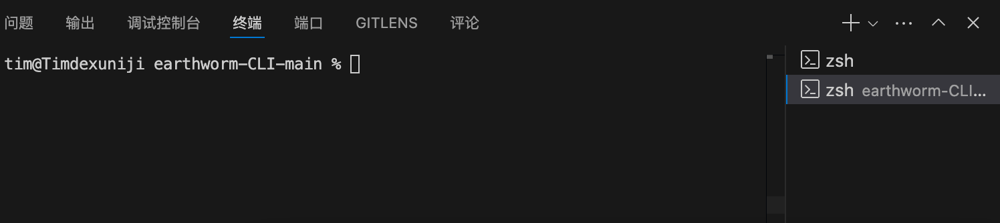

# English Learning CLI
一个使用命令行学习英语的工具，使用了 [Cuixueshe Earthworm](https://github.com/cuixueshe/earthworm) 的玩法和课程。


## Gif效果图



## Features

- 支持选择多个课程
- 支持随机选择课程
- 支持打乱顺序练习
- 支持只练习长句子（快速复习）
- 提示语支持中文、英文（默认英文，更隐蔽）

## 使用指南

### 安装依赖
```bash
pnpm install
```

### 开始
```bash
pnpm start
```

### 选择模式（按回车键进入下一步）
```bash
? Please select mode: (Use arrow keys)
❯ Manual select units
  Random select unit
```

### 手动模式下选择课程，可多选（按空格选中，回车进入下一步）
```bash
? Select one or more units: (Press <space> to select, <a> to toggle all, <i> to invert selection, and <enter> to proceed)
❯◯ 01.json
 ◯ 02.json
 ◯ 03.json
 ◯ 04.json
 ◯ 05.json
 ◯ 06.json
 ◯ 07.json
(Use arrow keys to reveal more choices)
```

### 选择答题模式（顺序模式、乱序模式、长句模式）
```bash
✔ Select one or more units: 01.json, 02.json
? Select practice mode: (Use arrow keys)
❯ Sequential Mode
  Random Mode
  Long Sentence Mode
```

### 开始答题
```bash 
✔ Please select mode: Manual select units
✔ Select one or more units: 01.json, 02.json
✔ Practice in order? Yes

Chinese meaning:我


? Please input the English translation:
```

## 切换语言
### 直接修改 language 字段切换语言
```javascript
let language = 'en'; // zh:中文 en:英文
const i18n = require(`./locales/${language}.js`);
```

## TODO
- 播放发音
- 更多课程

## 许可

本项目采用 MIT 许可证。详情请参阅 [LICENSE](LICENSE) 文件。


## 免责声明

本项目所使用的数据均来自于 [Cuixueshe Earthworm](https://github.com/cuixueshe/earthworm) 项目，未经原作者同意请勿用于商业用途。对于因使用本项目而导致的任何损失或问题，项目作者不承担任何责任。